<h3 align="center">
  </br>
  
</h3>

&nbsp;

<p align="center">
  <i>
    <span>☕ Chill first...</span></br>
    <span>...productivity later!</span>
  </i>
</p>

&nbsp;

video preview

&nbsp;

&nbsp;

&nbsp;

<h3 align="center">_ PREVIEW _</h3><br/>

&nbsp;

<p align="center">
    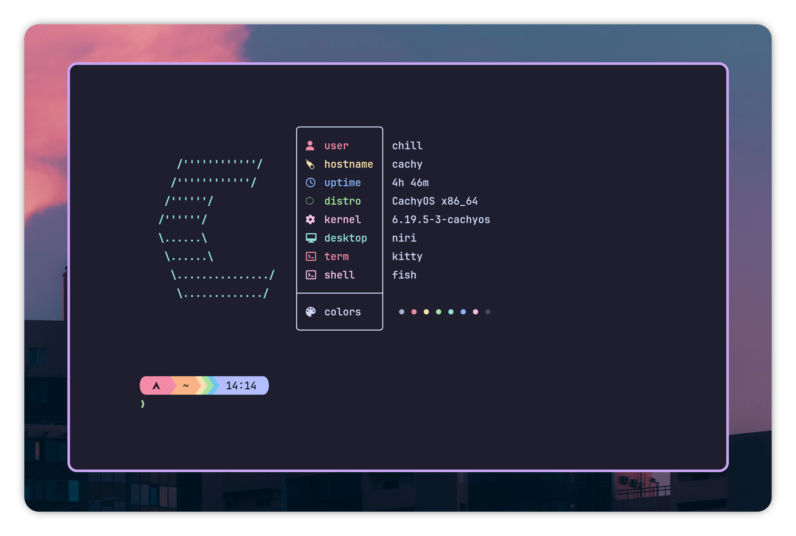</br>
    <sup>Terminal (kitty)</sup>
</p>
<p align="center">
    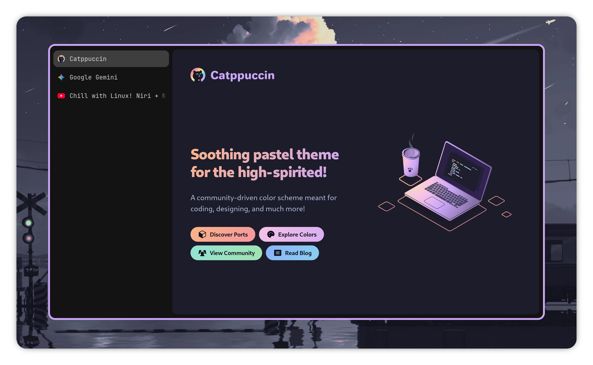</br>
    <sup>Zen Browser</sup>
</p>
<p align="center">
    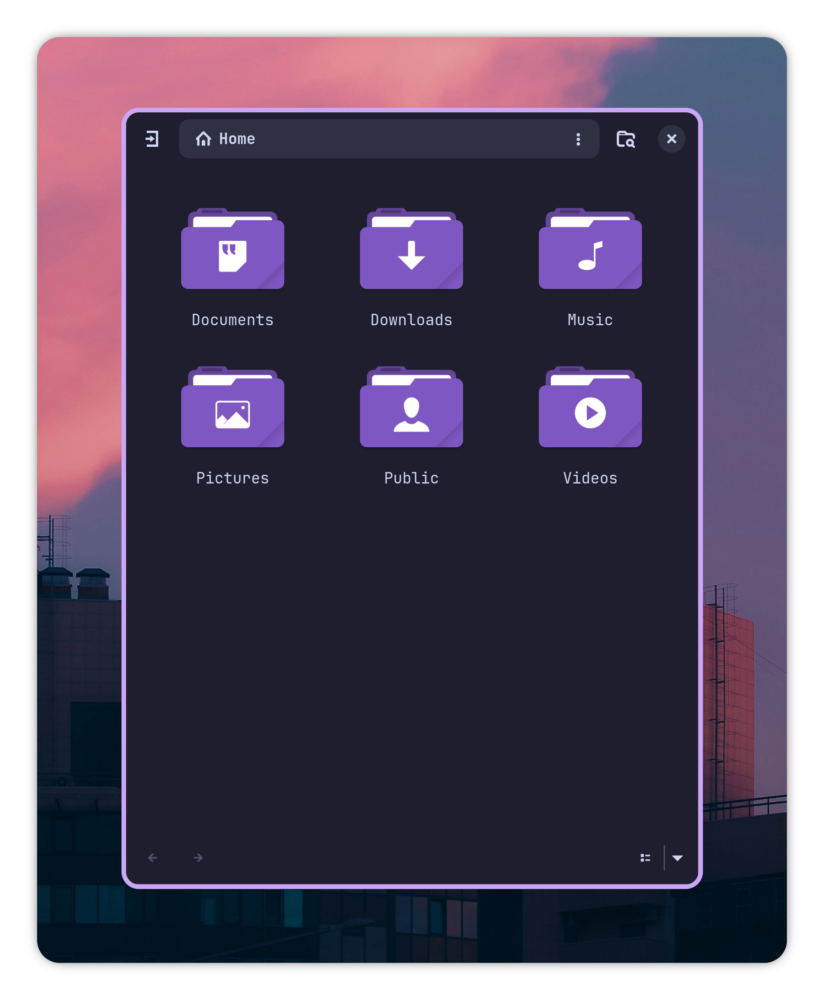</br>
    <sup>File Manager (Nautilus)</sup>
</p>
<p align="center">
    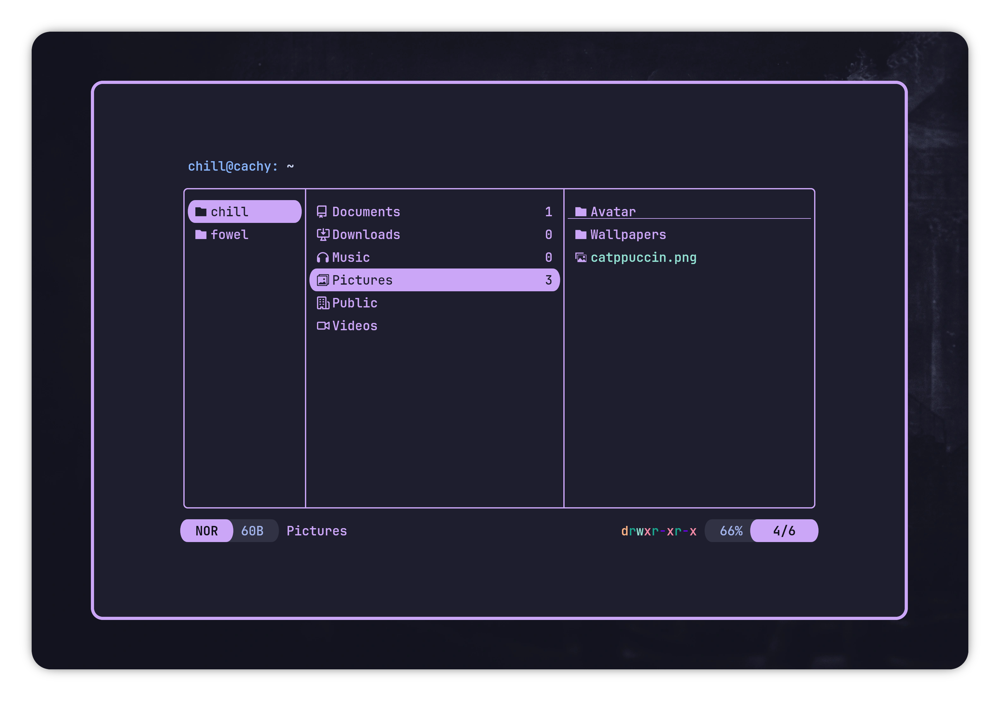</br>
    <sup>Terminal File Manager (yazi)</sup>
</p>

&nbsp;

&nbsp;

<h3 align="center">_ OVERVIEW _</h3>

&nbsp;

<table align="center">

<tr>
    <th colspan="99">
        <p align="center">System</p>
    </th>
</tr>

<tr align="center">
    <td>
        Distro
    </td>
    <td>
        Window Manager
    </td>
    <td>
        Desktop Shell
    </td>
</tr>

<tr>
    <td align="center">
        <br/>
        <a href="https://cachyos.org/">CachyOS</a></br>
        <sub>Arch at light speed</sub>
    </td>
    <td align="center">
        <br/>
        <a href="https://github.com/niri-wm/niri">niri</a></br>
        <sub>Infinity space</sub>
    </td>
    <td align="center">
        <br/>
        <a href="https://docs.noctalia.dev/getting-started/installation/">Noctalia</a></br>
        <sub><i>"quiet by design"</i></sub>
    </td>
</tr>

</table>

&nbsp;

<table align="center">

<tr>
    <th colspan="99">
        <p align="center">UI</p>
    </th>
</tr>

<tr align="center">
    <td>
        Color Theme
    </td>
    <td>
        Icons
    </td>
    <td>
        Fonts
    </td>
    <td>
        Mouse Cursor
    </td>
</tr>

<tr>
    <td align="center" valign="top">
        <br/>
        <a href="https://catppuccin.com/">Catppuccin</a></br>
        <sub>Chill!</sub>
    </td>
    <td align="center" valign="top">
        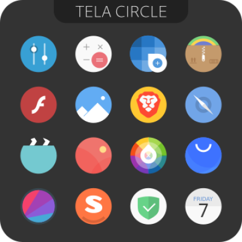<br/>
        <a href="https://github.com/vinceliuice/Tela-circle-icon-theme">Tela Circle</a></br>
        <sub>Quite nice</sub>
    </td>
    <td align="center" valign="top">
        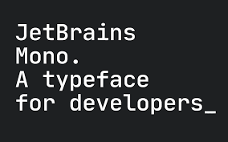<br/>
        <a href="https://fonts.google.com/specimen/JetBrains+Mono">JetBrains Mono</a></br>
        <sub>Best monospace</sub>
    </td>
    <td align="center" valign="top">
        <br/>
        <a href="https://github.com/ful1e5/Google_Cursor">GoogleDot</a></br>
        <sub>It's just circle</sub>
    </td>
</tr>

</table>

&nbsp;

<table align="center">

<tr>
    <th colspan="99">
        <p align="center">Apps</p>
    </th>
</tr>

<tr align="center">
    <td colspan="3">
        Terminal
    </td>
    <td colspan="2">
        File Manager
    </td>
    <td>
        Browser
    </td>
</tr>

<tr>
    <td align="center">
        <br/>
        <a href="https://fishshell.com/docs/current/">fish</a>
    </td>
    <td align="center">
        <br/>
        <a href="https://sw.kovidgoyal.net/kitty/">kitty</a>
    </td>
    <td align="center">
        <br/>
        <a href="https://starship.rs/">Starship</a>
    </td>
    <td align="center">
        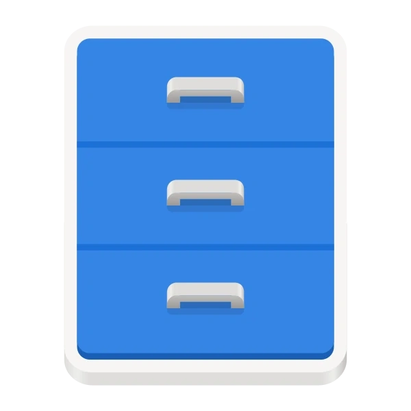<br/>
        <a href="https://yazi-rs.github.io/">Nautilus</a>
    </td>
    <td align="center">
        <br/>
        <a href="https://yazi-rs.github.io/">Yazi</a>
    </td>
    <td align="center">
        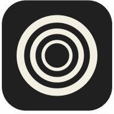<br/>
        <a href="https://zen-browser.app/">Zen Browser</a>
    </td>
</tr>

</table>

&nbsp;

&nbsp;

<h3 align="center">_ SETUP _</h3>

&nbsp;

### 🚀 How to install?

&nbsp;

🐱 You are a ***ULTRA-PRO-VIP*** Arch user?

If so, you are already familiar with _dotfiles_ (`~/.config`, `~/.local/bin`)

Just clone the repo:

```bash
git clone https://github.com/ForeverWeLearn/niri-dotfiles.git
```

Copy files from `src/.config` to your `~/.config`. Edit as you want.

&nbsp;

🤕 Or not? No problem, follow the guide 👇 

&nbsp;

<details>

<summary>
    <strong>🔥 niri</h4></strong>
</summary>

Copy `src/.config/niri` → `~/.config/niri`

```md
niri
├── base.kdl
├── config.kdl
├── noctalia.kdl
└── wallpaper.kdl
```

👇

##### 🖥️ Output

You may want to adjust `output` in `base.kdl` to match your screen *resolution* and *refresh rate*:

```kdl
// base.kdl

output "eDP-1" {
    mode "1920x1080@60"   // You may want to change this value
    scale 2.5             // Also this
}

// ...
```

Example: `1366x768@30`, `2560x1440@120`, `3840x2160@60`, ...

```kdl
// base.kdl

output "eDP-1" {
    mode "3840x2160@240"   // 4k at 240hz
    scale 1.5              // Smaller scale (smaller UI)
}

// ...
```

👇

##### 🖥️ Wallpaper mode

This setup use one wallpaper for all workspaces (similar to traditional desktop).

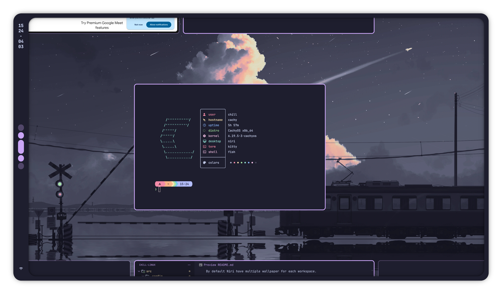

By default Niri have multiple wallpaper for each workspace.

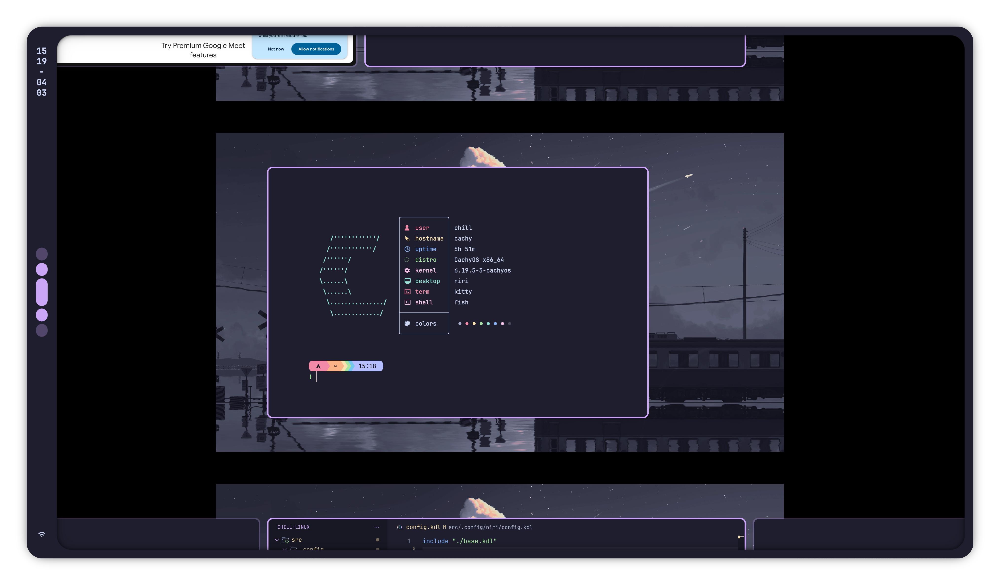

To use default, remove the import in `config.kdl`: 

```kdl
// config.kdl

include "./base.kdl"
include "./wallpaper.kdl"   // Remove this line

// ...
```
</details>

&nbsp;

<details>

<summary>
    <strong>🦉 Noctalia</h4></strong>
</summary>

Copy `src/.config/noctalia` → `~/.config/noctalia`

This Noctalia setup include 3 plugins:

<table>

<tr>
    <td valign="center" width="25%">
        <p align="center">
            <strong>Keybind Cheatsheet</strong></br>
            <code>Super+?</code>
        </p>
    </td>
    <td>
        <p align="center">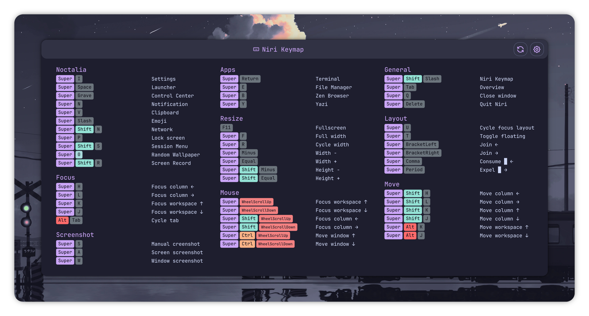</p>
    </td>
</tr>
<tr>
    <td valign="center" width="25%">
        <p align="center">
            <strong>Screen Recorder</strong></br>
            <code>Super+Shift+R</code>
        </p>
    </td>
    <td>
        <p align="center">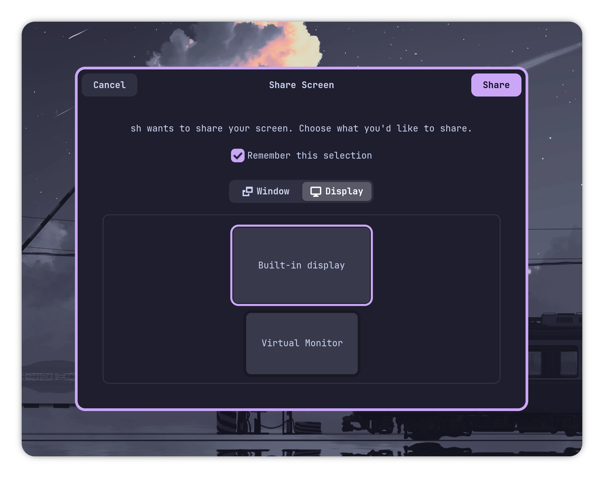</p>
    </td>
</tr>
<tr>
    <td valign="center">
        <p align="center">
            <strong>Privacy Indicator</strong>
        </p>
    </td>
    <td>
        <p align="center">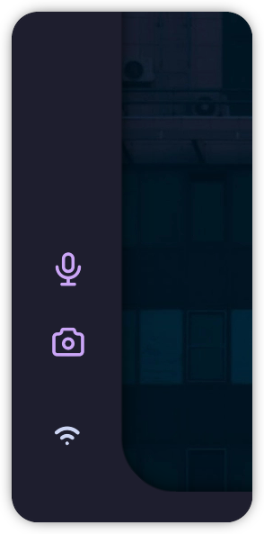</p>
    </td>
</tr>

</table>

</details>

&nbsp;

<details>

<summary>
    <strong>😽 kitty</h4></strong>
</summary>

Copy `src/.config/kitty` → `~/.config/kitty`

<table>
<tr>
    <th><p align="center">Before</p></th>
    <th><p align="center">After</p></th>
</tr>
<tr>
    <td>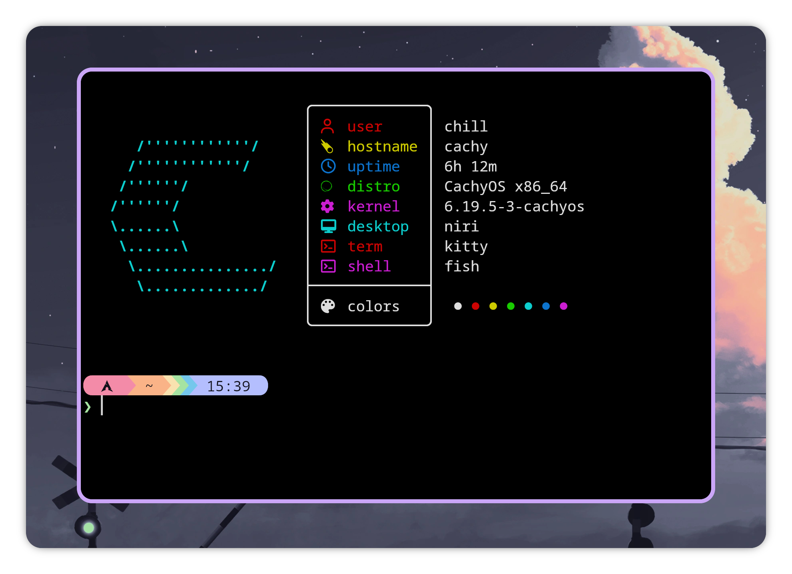</td>
    <td></td>
</tr>
</table>

You may change `window_padding_width` if you find it too wide:

```conf
# kitty.conf

window_padding_width        30 40   # Smaller

# ...
```

</details>

&nbsp;

<details>

<summary>
    <strong>🎮 yazi</h4></strong>
</summary>

Copy `src/.config/yazi` → `~/.config/yazi`

<table>
<tr>
    <th><p align="center">Before</p></th>
    <th><p align="center">After</p></th>
</tr>
<tr>
    <td valign="center">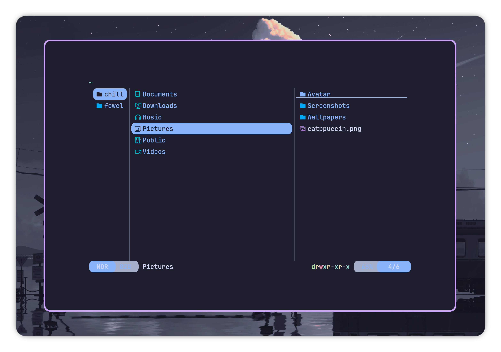</td>
    <td valign="center"></td>
</tr>
</table>

</details>

&nbsp;

<details>

<summary>
    <strong>🌐 Zen Browser</h4></strong>
</summary>

Zen is a little bit trickier to customize.

You would follow [Live Editing Zen Theme](https://docs.zen-browser.app/guides/live-editing) and use `src/.config/zen/userChrome.css` as source for your `userChrome.css`.

<table>
<tr>
    <th><p align="center">Zen original</p></th>
    <th><p align="center">With custom css</p></th>
</tr>
<tr>
    <td valign="center" width="45%">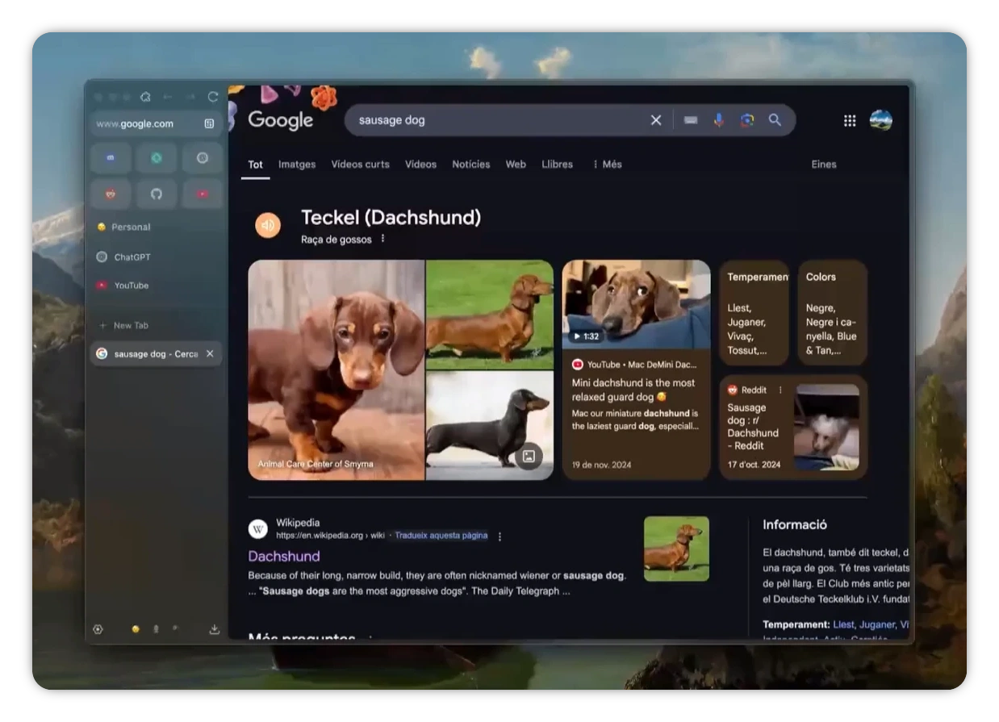</td>
    <td valign="center"></td>
</tr>
</table>

</details>

&nbsp;

#### 🖼️ Wallpapers

Find in `src/Pictures/Wallpapers`

To keep the mimimalist, this setup use only 3 wallpapers.

<table>
<tr>
    <td>
        
    <td/>
    <td>
        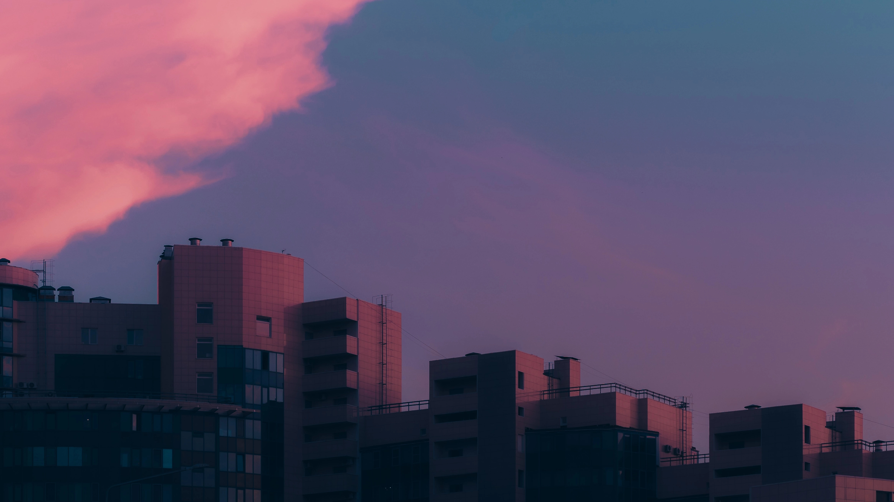
    </td>
    <td>
        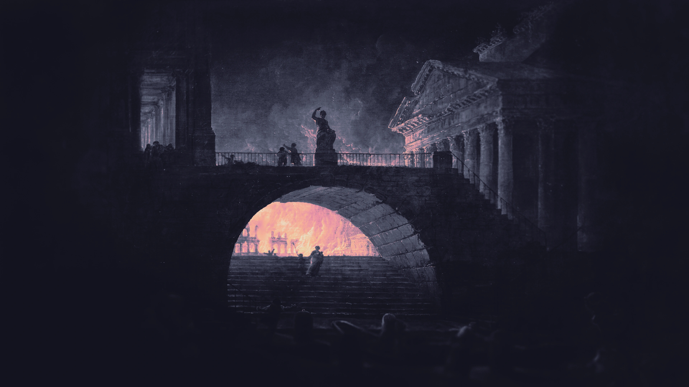
    </td>
</tr>
</table>

&nbsp;

&nbsp;

<p align="center"><i>Build with ❤️ by <strong>ForeverWeLearn</strong></i></p>